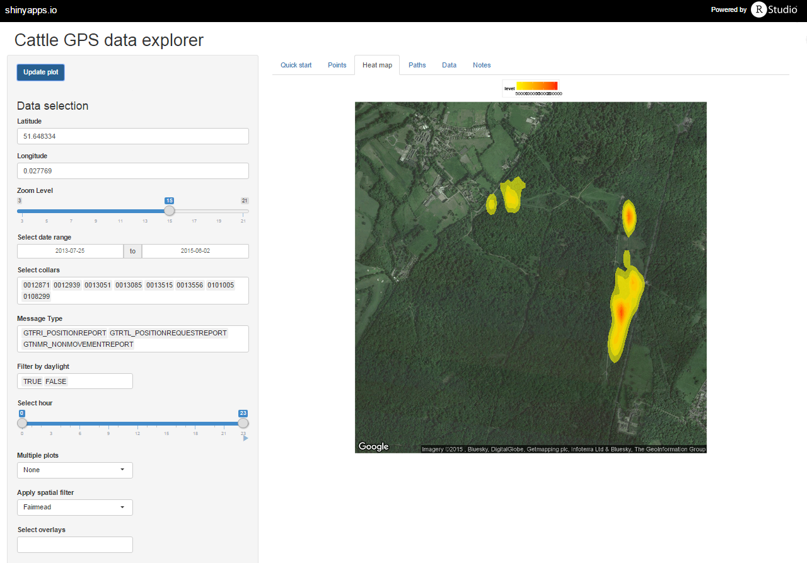

# CattleGeoViewer

This is the source code behind the implementation of *CattleGeoViewer* a shiny application available [here](https://cymbalaria.shinyapps.io/CattleGeoViewer).

CattleGeoViewer is a visualisation tool for visualising geospatial data recorded by cattle fitted with GPS collars.
The visualisation was conceived as part of Work Package 2 of the [Agforward](http://www.agforward.eu/index.php/en/hncv-agroforestry.html) project.

The data presented in the viewer is from [Epping Forest](http://www.cityoflondon.gov.uk/things-to-do/green-spaces/epping-forest/Pages/default.aspx), and was recorded using GPS collars manufactured by [CoSignal](http://www.cosignal.com/).
This data is accessible at present only through the [Global Alerting Platform REST API](https://developer.globalalerting.com/Api).
At present users are only able to download 1000 concurrent rows of data at once.
To overcome this limitation, a package was written in the R language to allow all the data to be downloaded at once.
This package [gapAPI](https://github.com/maupson/gapAPI) is also available on github, and is citeable with a [DOI](https://zenodo.org/record/19743#.Vh5sc_lVhBc) from zenodo.
Note that if you intend to use this package, you will need access to the GAP API with a username, password, and tenant code, which can only be supplied by one of CoSignal's customers.

## Using the *CattleGeoViwer* app

The app can be access at [https://cymbalaria.shinyapps.io/CattleGeoViewer](https://cymbalaria.shinyapps.io/CattleGeoViewer), and is relatively self-explantory.
Some default settings have already been selected, so two steps are required to generate a plot.
First select one of the tabs at the top of the page (Points, Heat map, or Paths) the press the 'Update Plot' button.

If the following **Error do not know how to convert 'input$date_select[1]' to class “Date”** occurs, ignore it and press 'Update Plot' again.
This error is known and is to do with the initial setup of the plot, it does not represent a real problem.

A plot of the data selected in the left-hand column.

### Plot options

The data can subseqeuntly be subset using the selectors to the left hand side of the page.

|Control|Function|
|---|---|
| Latitude | Select the latitude of the centre point of the plot. |
| Longitude | Select the longitude of the centre point of the plot. |
| Zoom level | Set the level of zoom required in the plot. |
| Select date range | Select the date range for the observations of interest. |
| Select collars | Select the range of collars for the observations of interest. Note that the online version of the app will struggle if you select all the collars at once for the full date range. |
| Message Type | The GAP API records a number of different message types which may or may not be relevant. The default selects only reports of movement, ad hoc position requests from subscribers to the service, and non movement reports, when the animals are stationary. The frequency of reports varies according to subscriber settings, typically between one minute and one hour. |
| Filter by daylight | The data can be subset by whetehr or not it was recorded during daylight hours or not. This calculation is made in the [scripts/sunset.R](scripts/sunset.R) file, and is based on Teets, D.A. 2003. 'Predicting sunrise and sunset times'. *The College Mathematics Journal* 34(4):317-321. |
| Select hour | In addition to filtering daylight hour, the data can also be filtered by hour or day using the slider.|
| Multiple plots | This drop down menu allows the plot to be subset into a number of plots following a filter on Year, Month, Week, Day, Weekday, Collar number, or Daylight/Nightime hours. |
| Apply Spatial filter | It is possible to apply a spatial filter to the data with this dropdown menu. This will filter out any points that are not within the polygons specified here. The possible options are 'Fairmead', 'Fairmead/HC13', and 'Fairmead/EK3'. Fairmead selects only data points which fall within the invisible fencing extents in the Fairmead area (see below). HC13 refers to areas which have been restored to Wood Pasture/Parkland, whilst EK3 refers to areas of 'very low input' grassland. |
| Select overlays | In conjunction with the sptial filters available above, the extents of the Wood Pasture/Parkland (WPP) restoration areas, and the grassland can be overlayed with transparency onto the plot. |
| Aesthetics | A number of aesthetic options are available to adjust the look of the plot: point/line transparency affects the transparency (alpha) of points, lines, and the fill in the heat maps plots. Number of bins affects the number of shaded regions that are created in heat maps. Point size and line width affect the look of point and line plots.|

### Data download

Once a selection of the data has been made using the filter described above, the filtered data can then be downloaded using the Data tab as a comma separated value (.csv) file.

## What's in this repository?

As noted, the *CattleGeoViewer* is a shiny application.
[Shiny](http://shiny.rstudio.com/) is a a web application framework for the [R language](https://www.r-project.org/).
This repository consists of two main components:

* [ui.R](ui.R)
    * This script handles the user interface described in teh previos sections.
* [server.R](server.R)
    * The R script which handles the 'back-end' of the application. This script calls upon a number of functions that are stored in the [scripts/](scripts) folder

### What there's no data?

This repository does not contain either raw data or the data behind overlays used for filtering.
These would need to be obtained from a GAP REST API client, for example Epping Forest.
    
## Bugs

At present the platform is a little buggy, and the server crashes with reaasonable frequently.
The exact reason behind this is not clear, but may be due to the low power of the free service supplied by shinyapps.io.
Running the app locally does not produce the same errors on either Windows 8 or Linux Ubuntu 14.04, and this is the recommended mode for running the App - locally.
